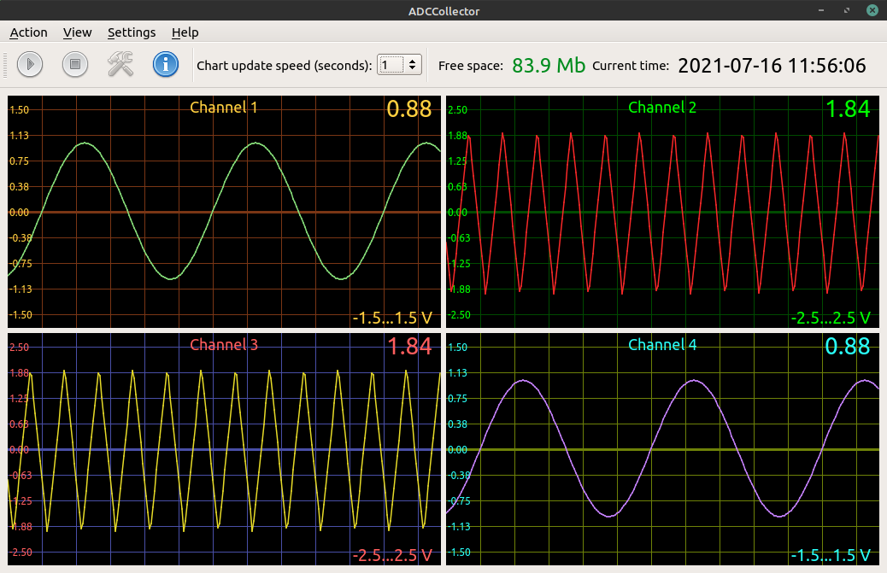

## Программа сбора данных с использование АЦП ЛА-И24USB
Данная программа производит сбор данных с использованием аналого-цифрового преобразователя ЛА-И24USB. Программа отображает графики полученных данных. Есть возможность настройки
каталогов записи данных, записи данных в бинарном и текстовом виде, настройки внешнего вида графиков.

Общий вид программы:

